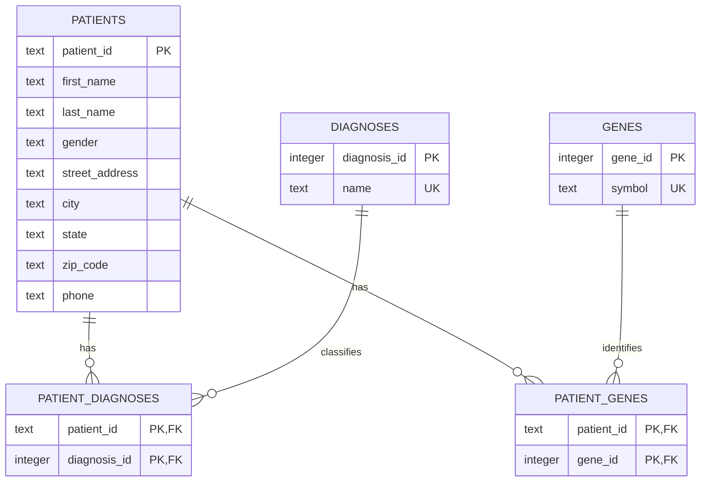

# Entity Relationship Diagram

## Notes

- `patients` stores one row per patient from `fake_patient_details.csv`.
- `diagnoses` and `genes` are lookup tables so repeated values are stored once.
- `patient_diagnoses` links patients to their cancer diagnosis.
- `patient_genes` supports patients having zero, one, or multiple genes.
- `patient_summaries` is a read-only SQL view used by the patient list API.
